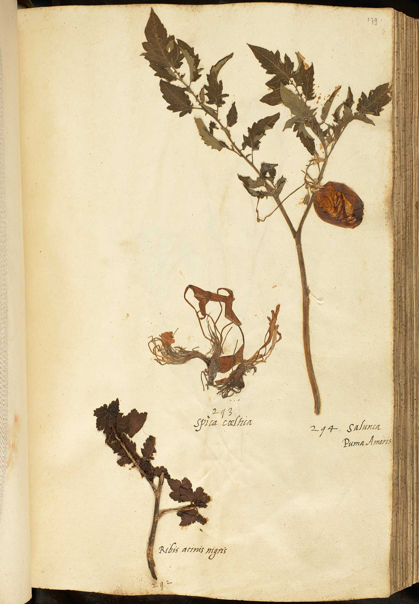

# tomatogenome-en-tibi

This repository contains the source and library code for analyzing the ancient genome
of the [_En Tibi_ tomato specimen](https://data.biodiversitydata.nl/naturalis/specimen/L.2111092).
The repository is organized in broad compliance with the community practices for Perl5 
([CPAN](http://cpan.org)) releases and is inspired by 
[guidelines](https://doi.org/10.1371/journal.pcbi.1000424) for organizing computational
biology projects.

# Contents

The repository is organized in the following folders:

- [doc](doc) - contains protocol descriptions, background literature, images, etc.
- [lib](lib) - generated library code for mapping between relational (SQLite)
  databases and Perl5 scripts using [DBIx::Class](https://search.cpan.org/dist/DBIx-Class).
  This library folder needs to be added to the `$PERL5LIB` environment variable
  in order for some scripts to work.
- [script](script) - contains Perl, Shell, Python and R scripts for various
  analysis steps.  
- [results](results) - inputs and outputs of various analysis steps.  

# License

MIT License

Copyright (c) 2019 Naturalis Biodiversity Center

Permission is hereby granted, free of charge, to any person obtaining a copy
of this software and associated documentation files (the "Software"), to deal
in the Software without restriction, including without limitation the rights
to use, copy, modify, merge, publish, distribute, sublicense, and/or sell
copies of the Software, and to permit persons to whom the Software is
furnished to do so, subject to the following conditions:

The above copyright notice and this permission notice shall be included in all
copies or substantial portions of the Software.

THE SOFTWARE IS PROVIDED "AS IS", WITHOUT WARRANTY OF ANY KIND, EXPRESS OR
IMPLIED, INCLUDING BUT NOT LIMITED TO THE WARRANTIES OF MERCHANTABILITY,
FITNESS FOR A PARTICULAR PURPOSE AND NONINFRINGEMENT. IN NO EVENT SHALL THE
AUTHORS OR COPYRIGHT HOLDERS BE LIABLE FOR ANY CLAIM, DAMAGES OR OTHER
LIABILITY, WHETHER IN AN ACTION OF CONTRACT, TORT OR OTHERWISE, ARISING FROM,
OUT OF OR IN CONNECTION WITH THE SOFTWARE OR THE USE OR OTHER DEALINGS IN THE
SOFTWARE.

