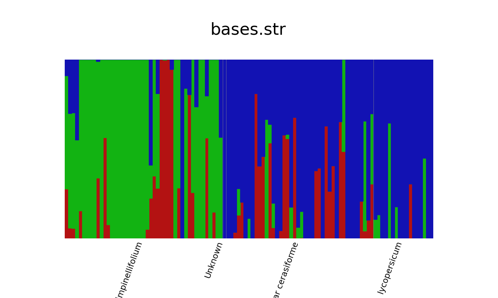

Structure analysis
==================

1. Producing input file
-----------------------

The input file is produced with the Perl script
[make_structure_table.pl](https://github.com/naturalis/tomatogenome-en-tibi/blob/master/script/make_structure_table.pl)
In addition, it needs access to the SQLite database file `EnTibiBasesRemapped.db` from the
[snpdb.zip](http://doi.org/10.5281/zenodo.4966843) archive.

```

make_structure_table.pl -o str -v -d EnTibiBasesRemapped.db > bases.str

```

As it turns out, the SNPs database contains some accessions that we are not really 
interested because they are more distal species. We manually removed the following 
accessions:

- TS.407
- TS.208
- TS.408
- TS.199
- TS.207
- TS.217
- TS.403
- TS.402
- TS.404
- TS.146

2. Structure analysis
---------------------

This step operates on the file `bases.str` with 
[fastSTRUCTURE](https://github.com/rajanil/fastStructure/commit/e47212f816a77495bb79274b662ff70d7ec5a55f)

What needs to happen is a parameter sweep to find the MLE of K, the number of ancestral
populations invoked to describe the observed patterns of genetic diversity in the data
set. The following loop produces the `bases.str.${K}.*` files:

```

for K in "1 2 3 4 5 6 7 8"; do
	python structure.py \
		-K $K \
		--input=bases \
		--output=bases.str \
		--format=str
done
	
```

3. Find MLE
-----------

Here we select the maximum likelihood estimate for the number of populations (3):

```

python chooseK.py --input=bases.str
# Model complexity that maximizes marginal likelihood = 3
# Model components used to explain structure in data = 4


```

4. Results
----------

The MLE is for 3 ancestral populations. The genomes of the individual accessions have 
been assigned to these populations like this:



These results are also available as machine readable data using the files
[bases.str.3.meanQ](bases.str.3.meanQ.gz) for the assignments, [labels.txt](labels.txt)
for the accession labels, and [popfile.txt](popfile.txt) for the assignment of the
accessions to their respective populations.
